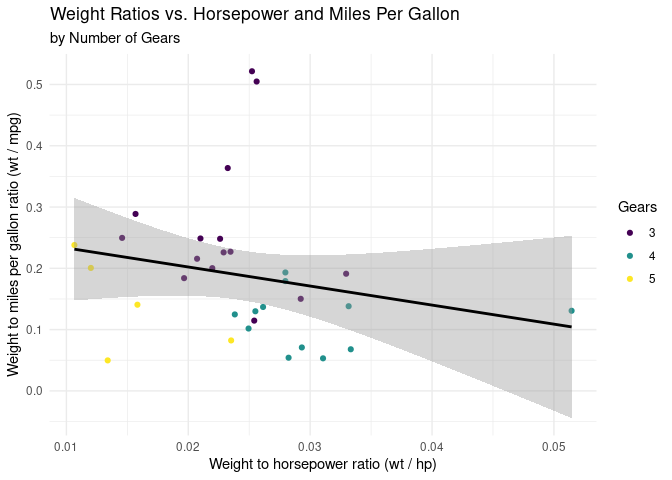

Merge Conflict Activity
================

## Setup

1.  Everyone should clone the provided repository.
2.  Assign numbers 1 and 2 to each team member.

## Let’s Cause a Merge Conflict!

Our goal is to understand and resolve different types of merge conflicts
and get familiar with common Git errors that may occur when pushing and
pulling files between GitHub and RStudio.

**Before starting:** Ensure everyone has cloned the repository and knows
their assigned role number.

### Instructions

Please follow the instructions carefully and take turns completing the
exercise. When it’s not your turn, observe and learn from your
teammate’s actions. Do not make any changes to your project until it’s
your turn.

### Merge Conflict Scenario

#### Role 1:

- Change the team name to your actual team name.
- Knit, commit, and push.

🛑 **Wait for Role 2 to complete their task before moving forward.**

#### Role 2:

- Change the team name to some other word.
- Knit, commit, and push. You should encounter an error.
- Pull the changes and observe the merge conflict in the document.
- Resolve the merge conflict by editing the document to choose the
  correct/preferred change.
- Knit the document.
- Stage all files in your Git tab by clicking the ‘Stage’ checkbox for
  each file. Ensure they all have checkmarks, not filled-in boxes.
- Commit and push the changes.

🛑 **Wait for Role 1 to complete their task before moving forward.**

### Automatic Merge Scenario

#### Role 2 (or 3):

- Change the label of the first code chunk.
- Knit, commit, and push. You should encounter an error.
- Pull the changes. No merge conflicts should occur, but you should see
  a message about merging.
- Now, push the changes.

🛑 **Wait for Role 1 to complete their task before moving forward.**

#### Role 1:

- Change the label of the first code chunk to something different from
  what Role 2 did.
- Knit, commit, and push. You should encounter an error.
- Pull the changes and observe the merge conflict in the document.
  Resolve the merge conflict by choosing the correct/preferred change.
- Commit and push the changes.

🛑 **Wait for Role 2 to complete their task before moving forward.**

**Everyone:** Pull the changes and observe the final state of the
document.

### Review and Discussion

Now that you have experienced and resolved different types of merge
conflicts, discuss with your team members the challenges you faced and
the strategies you employed to overcome them. Ensure everyone
understands the importance of proper communication and coordination when
working with Git and GitHub in a collaborative environment.

## Code Chunk to Change

<!-- -->
